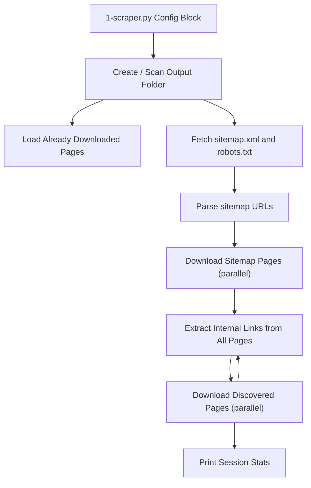

# Implement SEO Scraper

## Architecture Overview

## File Structure

All scraped pages go into `./scraped/<website_id>/` (e.g. `./scraped/example_com/`). A page at `https://example.com/blog/post-1` returning 200 is saved as `./scraped/example_com/blog/200-post-1.html`. The sitemap XML and robots.txt are saved at the root of the website folder.

## Files to Implement

### 1. [utils_requests.py](utils_requests.py) - HTTP utilities

- `get_session(username, password) -> httpx.AsyncClient` - Creates a configured async HTTP client with realistic browser User-Agent, standard headers, optional HTTP Basic Auth, redirect following, and timeouts.
- `fetch_page(client, url) -> tuple[int, str, str]` - Fetches a single URL, returns `(status_code, final_url, body)`. Handles exceptions gracefully (returns status 0 on network errors).

### 2. [utils_html.py](utils_html.py) - HTML parsing utilities

- `extract_internal_links(html, base_url) -> set[str]` - Parses HTML with `BeautifulSoup`, finds all `<a href>` links, resolves relative URLs, filters to same-domain only, normalizes (strips fragments/trailing slashes), returns a set of absolute internal URLs.
- `parse_sitemap(xml_content, base_url) -> list[str]` - Parses a sitemap XML. Handles both `<urlset>` (leaf sitemap) and `<sitemapindex>` (sitemap index pointing to sub-sitemaps). Returns a flat list of page URLs.

### 3. [utils_files.py](utils_files.py) - File I/O utilities

- `get_website_id(url) -> str` - Converts `https://example.com` to `example_com`.
- `get_page_path(base_dir, url, status_code) -> Path` - Computes the on-disk path for a page using the Page ID convention: `<base_dir>/<nested-path-dirs>/<status_code>-<slug>.html`. The index/root page becomes `200-index.html`.
- `save_page(base_dir, url, status_code, content) -> Path` - Saves page HTML to disk using `get_page_path`, creating intermediate directories as needed.
- `load_existing_pages(base_dir) -> set[str]` - Scans an existing website folder recursively, reconstructs the original URLs from the file structure, and returns a set of URLs already downloaded. This enables resumability across runs.

### 4. [1-scraper.py](1-scraper.py) - Main scraper script

- **Config block** at the top with hardcoded values: `WEBSITE_URL`, `MAX_PAGES` (default 100), `HTTP_AUTH_USERNAME`, `HTTP_AUTH_PASSWORD`, `PARALLELISM` (default 20).
- **Main async function** that orchestrates the full flow:
  1. Derive `website_id`, create output folder.
  2. Load already-downloaded URLs from previous runs.
  3. Fetch and save `robots.txt` and `sitemap.xml`.
  4. Parse sitemap (handle sitemap index recursively).
  5. Download all sitemap URLs in parallel (up to `PARALLELISM` concurrent, respecting `MAX_PAGES`, skipping already-downloaded).
  6. Loop: extract internal links from all downloaded pages, download new ones, repeat until no new links or `MAX_PAGES` reached.
  7. Print session stats: total pages, status code breakdown, new vs. already-existing, etc.
- Uses `asyncio.Semaphore(PARALLELISM)` for concurrency control, and a shared `set` of visited URLs (no race conditions since we gather tasks in batches, updating the set between batches).

## Key Libraries

- **httpx** (async HTTP client with HTTP/2 support, auth, redirects)
- **beautifulsoup4** + **lxml** (HTML/XML parsing)
- Standard library: `asyncio`, `pathlib`, `urllib.parse`

A `requirements.txt` will be created with: `httpx`, `beautifulsoup4`, `lxml`.

## Concurrency Strategy

To avoid race conditions, the scraper uses a **batch-based approach**:

1. Collect a batch of URLs to fetch (filtering out already-visited).
2. Mark them all as visited immediately (before fetching).
3. Fetch the batch in parallel with a semaphore limiting to 20 concurrent requests.
4. After the batch completes, extract new internal links from results.
5. Repeat with the next batch of newly discovered URLs.

This means the visited set is only mutated between batches (single-threaded), never during parallel I/O.

## Resumability

On re-run, `load_existing_pages()` scans the output folder and reconstructs which URLs were already fetched. These are pre-populated into the visited set so they are skipped. The sitemap + robots.txt are always re-fetched (they may have changed).