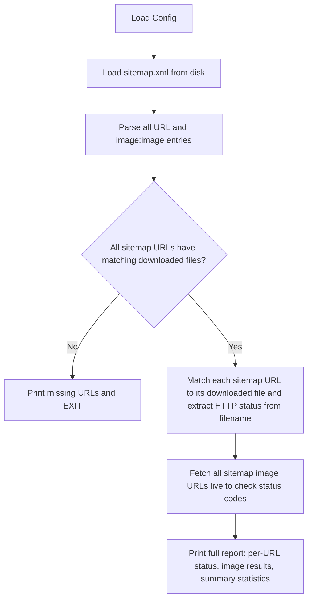

# Sitemap Checker (`2-sitemap.py`)

## Context

The scraper (`[1-scraper.py](1-scraper.py)`) has already run and produced:

- `scraped/<website_id>/sitemap.xml` -- the downloaded sitemap
- `scraped/<website_id>/<status>-<slug>.html` -- downloaded pages (49 pages for the test site)

The sitemap XML contains `<url>` entries with `<loc>`, optional `<lastmod>`, `<changefreq>`, `<priority>`, and optional `<image:image>` / `<image:loc>` tags.

The IDEA.md spec for script #2 says:

1. Hardcoded website URL at the top
2. Parse the sitemap and cross-check every URL against downloaded pages. **Exit immediately** if sitemap wasn't fully downloaded.
3. For sitemap entries with `<image:image>` tags, download each image and check its HTTP status. Report image stats separately.
4. Show statistics: counts of 2xx, 3xx, 4xx, 5xx pages. Highlight errors and redirects. Full debug dump of every sitemap URL and its status.

## Architecture

The script will be **offline-first for pages** (reads from disk) but **online for images** (fetches them live to check status). This matches the design: the scraper downloads pages, and the sitemap checker analyzes what was downloaded.




## Key Design Decisions

- **Page status detection**: Read from disk filenames (`200-slug.html`, `301-slug.html`, etc.). We do NOT re-fetch pages. The scraper already saved them with their status code in the filename.
- **Image checking**: Fetch each `<image:loc>` URL with a HEAD request (lightweight, no body download). Use the same `utils_requests` infra with parallelism.
- **Sitemap completeness check**: Compare sitemap `<loc>` URLs against files on disk. If any URL has no matching file, print which ones are missing and exit with an error, per the spec.
- **Reuse existing utilities**: `utils_files.get_website_id`, `utils_files.url_to_path_key`, `utils_html.parse_sitemap` (will need enhancement for images), `utils_requests.get_session`.

## Changes Required

### 1. Enhance `parse_sitemap` in `[utils_html.py](utils_html.py)`

Current `parse_sitemap` only returns `(page_urls, sub_sitemap_urls)`. We need to also extract:

- `<image:image>` > `<image:loc>` URLs per `<url>` entry
- Optional `<lastmod>`, `<changefreq>`, `<priority>` metadata

Add a new function `parse_sitemap_detailed()` that returns a list of dataclass/dict entries:

```python
@dataclass
class SitemapEntry:
    loc: str
    lastmod: str | None
    changefreq: str | None
    priority: str | None
    images: list[str]  # image:loc URLs
```

Keep the existing `parse_sitemap()` unchanged so `1-scraper.py` is unaffected.

### 2. Add `fetch_head` to `[utils_requests.py](utils_requests.py)`

Add a lightweight HEAD request function for image checking:

```python
async def fetch_head(client, url) -> tuple[int, str]:
    """HEAD request. Returns (status_code, redirect_url)."""
```

### 3. Add `find_page_file` to `[utils_files.py](utils_files.py)`

Add a helper that, given a URL, finds its corresponding file on disk regardless of status code:

```python
def find_page_file(base_dir: Path, url: str) -> tuple[Path | None, int | None]:
    """Find downloaded page file for URL, return (path, status_code) or (None, None)."""
```

This will glob for `*-<slug>.html` in the correct subdirectory and extract the status from the filename.

### 4. Implement `[2-sitemap.py](2-sitemap.py)`

Structure:

- **Config block**: `WEBSITE_URL`, `HTTP_AUTH_USERNAME`, `HTTP_AUTH_PASSWORD`, `PARALLELISM`
- **Step 1**: Load `sitemap.xml` from disk, parse with `parse_sitemap_detailed()`
- **Step 2**: For each sitemap URL, find matching downloaded file. If any missing, print them and exit
- **Step 3**: Collect all image URLs from sitemap entries, fetch them in parallel with HEAD requests
- **Step 4**: Print full report:
  - Per-URL table: URL, status code, lastmod, image count, image statuses
  - Highlighted section for errors (4xx/5xx) and redirects (3xx)
  - Image statistics section (total images, 2xx/3xx/4xx/5xx breakdown, list of broken images)
  - Summary statistics (total URLs, status code breakdown)

Output will be colorized terminal output using ANSI escape codes (matching the style of `1-scraper.py`).