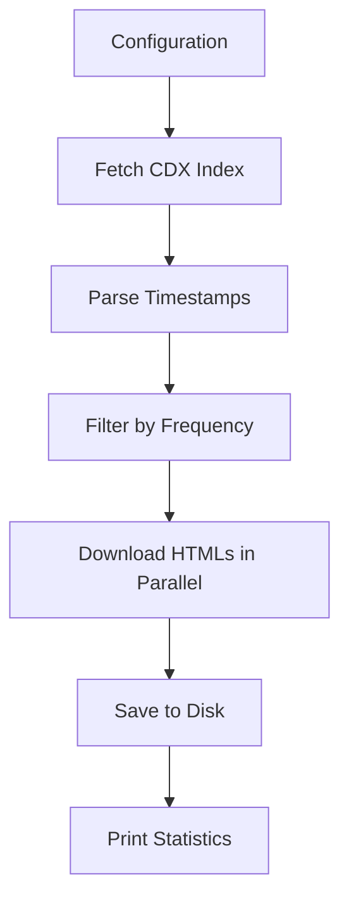

# Wayback Machine Scraper Implementation

## Overview

Implement step "4 - Wayback Machine Scraper" from [IDEA.md](IDEA.md). The tool will:

- Query the Wayback Machine CDX API for all available snapshots
- Filter snapshots to one per time period (default: monthly)
- Download HTML snapshots and save them locally
- Follow existing code conventions (async httpx, type hints, docstrings)

## Architecture




## Files to Create/Modify

### 1. New: `utils_wayback.py` - Reusable Wayback Machine utilities

Contains shared functions for interacting with web.archive.org:

- `fetch_cdx_snapshots(url, client)` - Query CDX API, return list of snapshot records
- `filter_snapshots_by_frequency(snapshots, frequency)` - Select one snapshot per period
- `build_wayback_url(url, timestamp)` - Construct the `id_` URL for original HTML
- `parse_timestamp(ts)` - Parse Wayback timestamp format (YYYYMMDDhhmmss) to datetime

Key design decisions:

- Use async httpx (consistent with `utils_requests.py`)
- CDX API returns: timestamp, original URL, status code, digest
- Use `id_` modifier in URL to get original HTML without Wayback modifications

### 2. Modify: `4-webarchieve.py` - Main script

Refactor existing code into a proper async script following conventions from `1-scraper.py`:

**Configuration section:**

```python
WEBSITE_URL = "https://example.com"
FREQUENCY = "monthly"  # daily, weekly, monthly
PARALLELISM = 5  # Lower than main scraper to be polite to archive.org
```

**Output folder:** `{WEBSITE_ID}_archive/` (as specified in IDEA.md)

**Flow:**

1. Create output directory `{WEBSITE_ID}_archive/`
2. Fetch all snapshots from CDX API (paginated if needed)
3. Save raw CDX JSON response for reference
4. Filter snapshots by frequency (pick middle timestamp of each period)
5. Download HTMLs in parallel with semaphore
6. Save with naming: `{YYYYMMDD}-{HHMMSS}.html`
7. Print statistics (total snapshots, downloaded, date range, errors)

### 3. Modify: `utils_files.py` - Add archive-specific helpers

Add functions for archive folder management:

- `get_archive_folder_id(url)` - Returns `{website_id}_archive`
- `get_snapshot_path(base_dir, timestamp)` - Returns path for snapshot HTML

## Snapshot Selection Strategy

For "middle point" selection per the IDEA.md requirements:

```
Monthly frequency example:
Jan 2024: [Jan 3, Jan 15, Jan 28] -> pick Jan 15
Feb 2024: [Feb 1, Feb 14, Feb 22] -> pick Feb 14
```

Implementation: Group snapshots by period, select the one closest to the middle of the period.

## Error Handling

- CDX API errors: Log and exit with message
- Individual snapshot fetch errors: Log, continue, track in stats
- Rate limiting: Use lower parallelism (5) and respect archive.org

## Output Structure

```
example_com_archive/
  cdx_index.json       # Raw CDX response for reference
  20230115-120000.html # Snapshot from Jan 15, 2023
  20230215-143022.html # Snapshot from Feb 15, 2023
  ...
```

